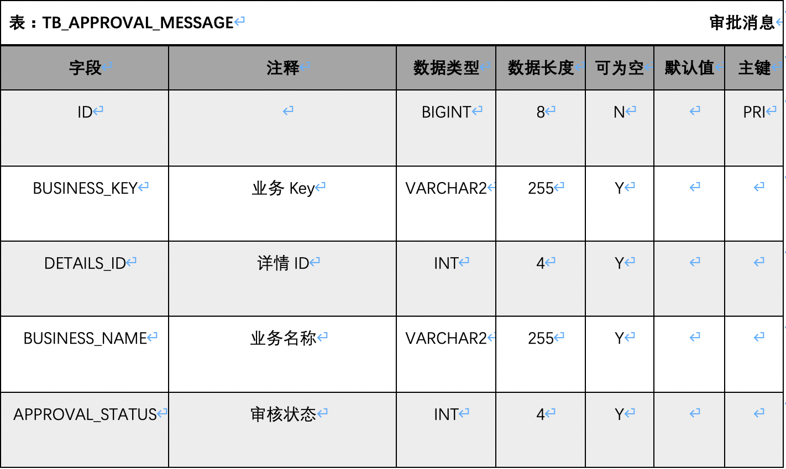

### 文档样式

---



---

### 使用

- 下载项目

- 项目默认使用达梦7驱动 在`start`模块下`pom.xml`文件 77至81行代码
```xml
<!-- 如需使用达梦8驱动请自行替换成以下坐标信息 -->
<dependency>
    <groupId>com.dameng</groupId>
    <artifactId>Dm8JdbcDriver18</artifactId>
    <version>8.1.1.49</version>
</dependency>
```

- 修改`start`模块`resources`目录下`application.yml`配置文件

  - 修改数据库配置信息

  ```yaml
  spring:
    datasource:
    # 数据库地址
    url: jdbc:dm://127.0.0.1:5236
    # 用户名
    username: TEST
    # 密码
    password: TEST
    
  ```

  - 修改模板输出文件位置

  ```yaml
  freemarker:
    # 生成文档文件输出路径
    outFilePath: /Users/Test/Desktop
    # 文档名称 注意必须已.doc文件结尾
    outFileName: dmdb.doc
  ```

- 接口调用
  - `http://localhost:8080/dmdbDoc/generateDoc`（生成文档）
  - `http://localhost:8080/dmdbDoc/getAllTablesByUser`（返回当前数据库用户下所有表）
  - `http://localhost:8080/dmdbDoc/getTableAllFieldByTableName?tableName=TEST`（根据表名返回表结构信息）

